# 💖 Ling AI Agent — Intelligent Relationship & Life Assistant

An AI-powered multi-agent system built with **Spring AI 1.0.0**, combining  
LLM orchestration, RAG knowledge retrieval, cross-encoder reranking, tool calling,  
and PDF generation to provide personalized relationship guidance and life assistance.

[](https://openjdk.org/)
[](https://spring.io/projects/spring-boot)
[](https://spring.io/projects/spring-ai)
[](https://www.docker.com/)
[](https://aws.amazon.com/)

---

## 🚀 Key Features

- 💬 **AI Love Coach**
  - Real-time streaming responses via SSE (Server-Sent Events)
  - Personalized advice powered by RAG knowledge retrieval
  - Context-aware dialogue with persistent chat memory

- 🤖 **AI Super Agent (LingManus)**
  - Autonomous ReAct Agent completing tasks in **avg 6-8 steps**
  - 6 built-in tools: web search, scraping, file ops, terminal, download, PDF generation
  - Stuck-loop detection with automatic recovery strategy

- 🧠 **Retrieval-Augmented Generation (RAG)**
  - Custom document ingestion pipeline with batch processing
  - Hybrid retrieval combining **vector similarity + BM25 keyword search via Reciprocal Rank Fusion (RRF)**
  - Reduced embedding API calls from **30 → 2 per document** via batch ingestion
  - Cross-encoder reranking (ms-marco-MiniLM-L-6-v2) via Python FastAPI microservice
  - Vector search powered by **PGVector + HNSW indexing**
  - Query rewriting for improved retrieval relevance
  - SHA-256 content-based deduplication

- 📊 **Observability**
  - LangSmith tracing via OpenTelemetry for step-level visibility
  - Real-time monitoring of RAG retrieval and agent reasoning steps
  - Token usage and latency tracking per request

- 🔧 **Multi-LLM Support**
  - GPT-4o (OpenAI) — primary provider
  - Qwen-Plus (DashScope) — alternative provider
  - Switchable via configuration with zero code changes

- 🔌 **MCP Protocol Integration**
  - Custom MCP Server with Pexels image search
  - Supports both Stdio and SSE transport modes

---

## 📊 Performance Metrics

| Metric | Result |
|--------|--------|
| Average API response time | ~3.8s (AI inference included) |
| P95 latency (10 concurrent users) | ~6.1s |
| Error rate under load | **0%** |
| Throughput | **41 req/min** |
| Agent avg task completion | **6-8 steps** (max 20) |
| Embedding API calls optimized | **30 → 2** per document |

> Load tested with Apache JMeter: 10 concurrent users × 10 iterations

---

## 🏗 System Architecture

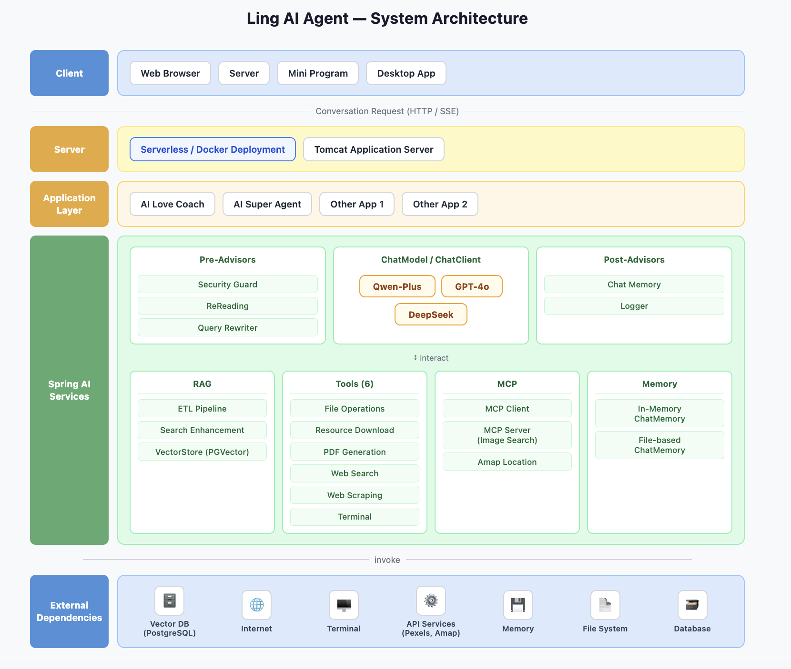

---

## 🖥 Application Screenshots

### 🏠 Home Page
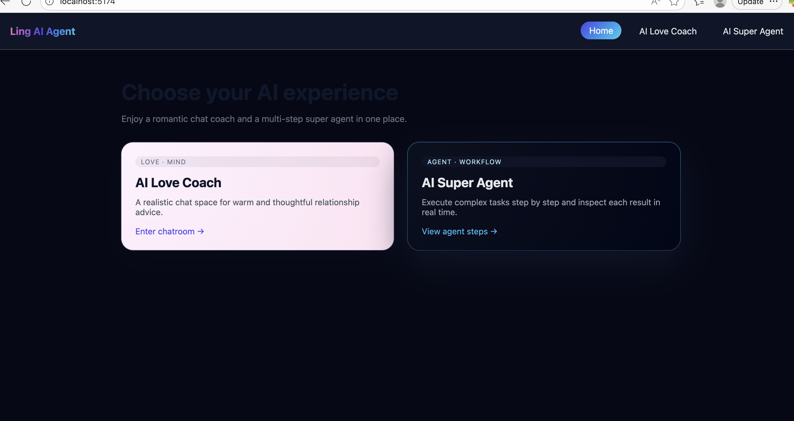

### 💬 AI Love Coach
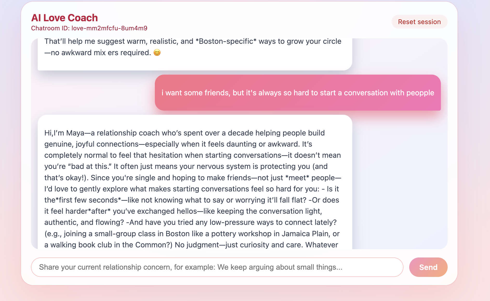
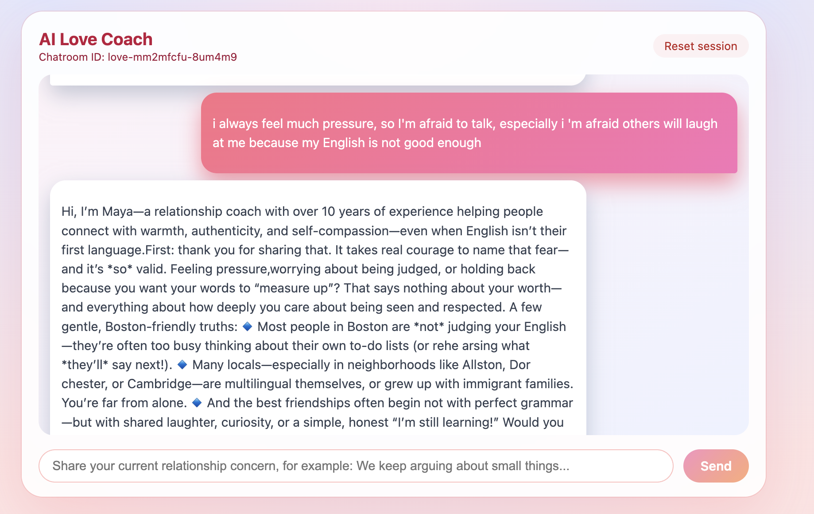
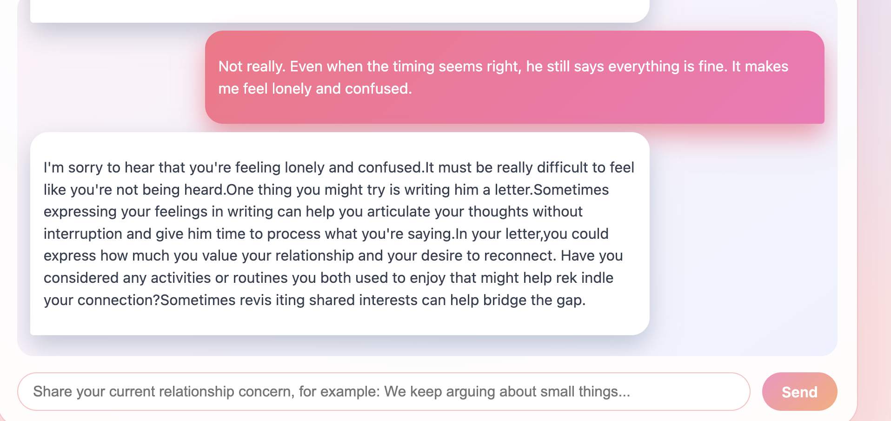

### 🤖 AI Super Agent
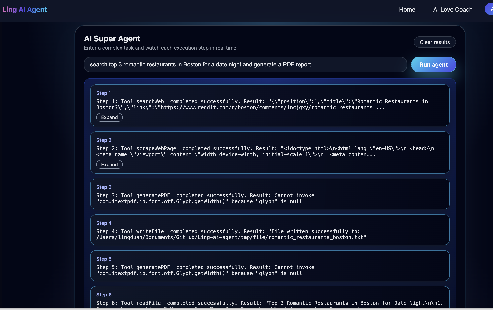
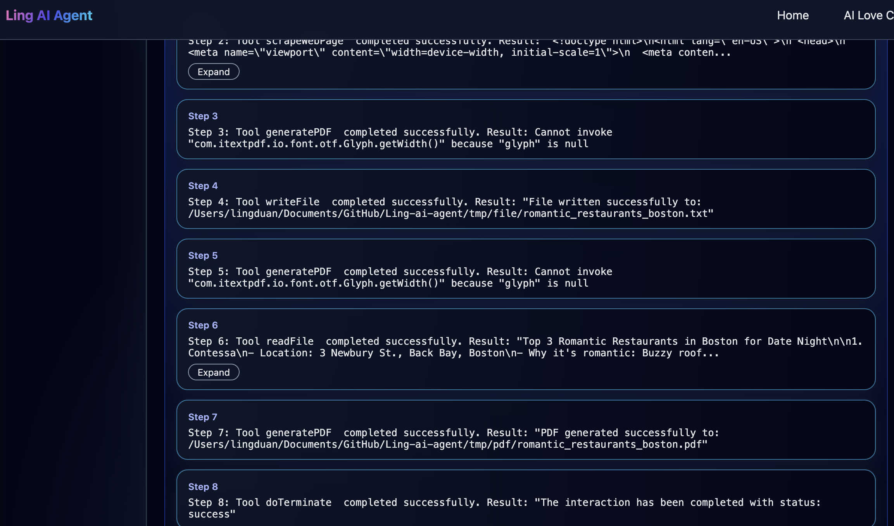

### 📄 PDF Generation Result
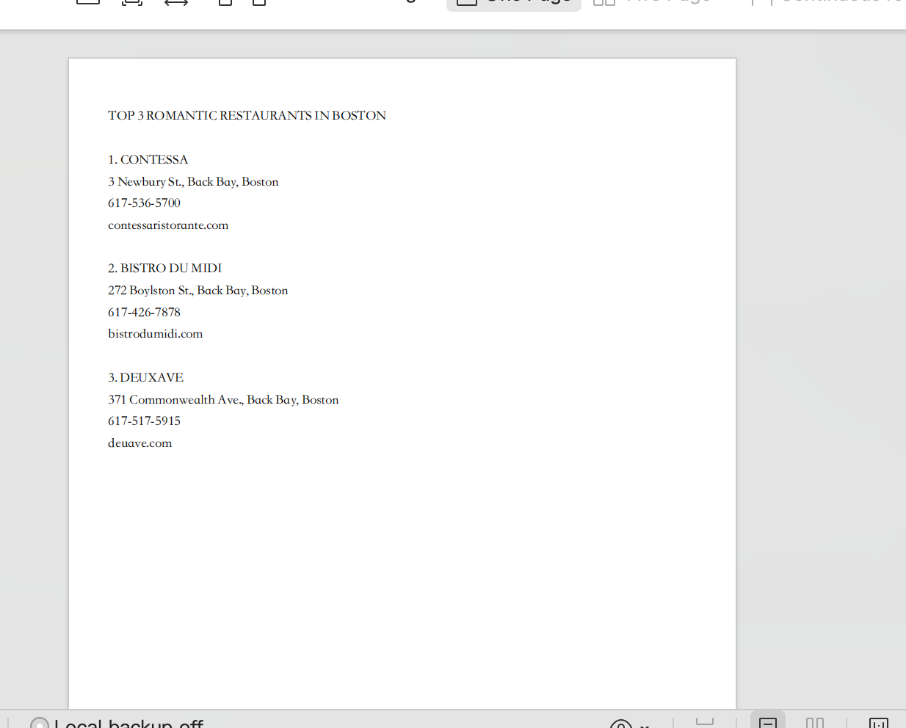

### 📊 LangSmith Tracing
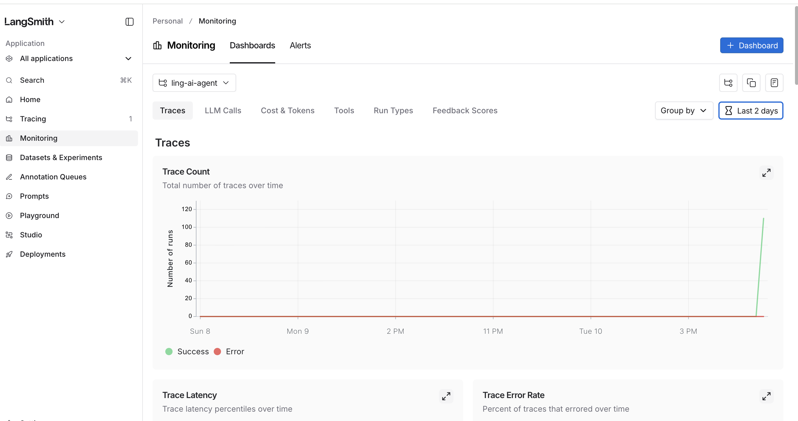
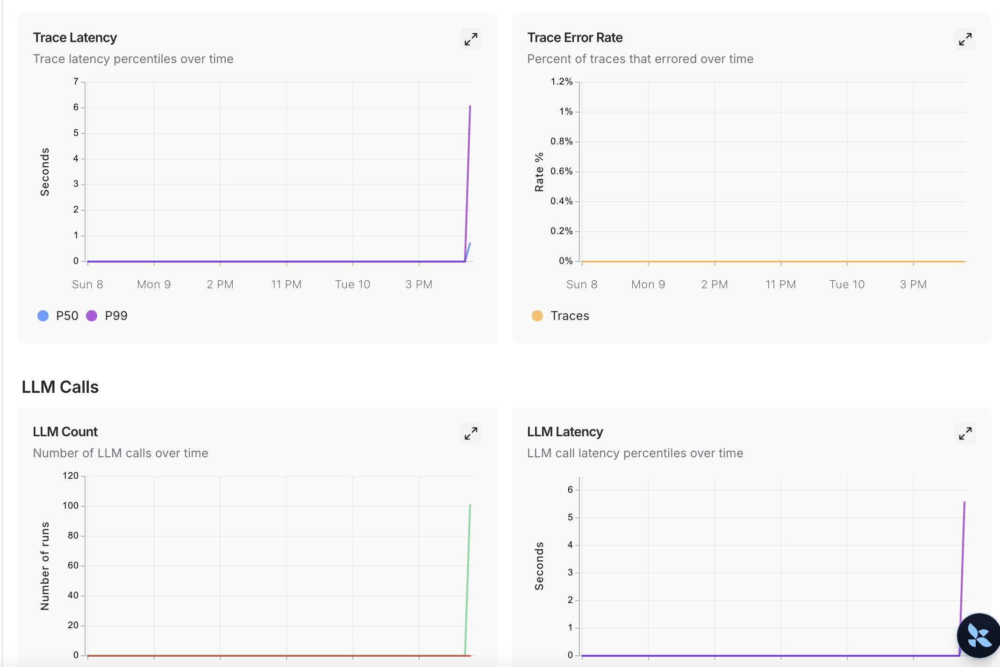

### 🔍 RAG Citation Sources
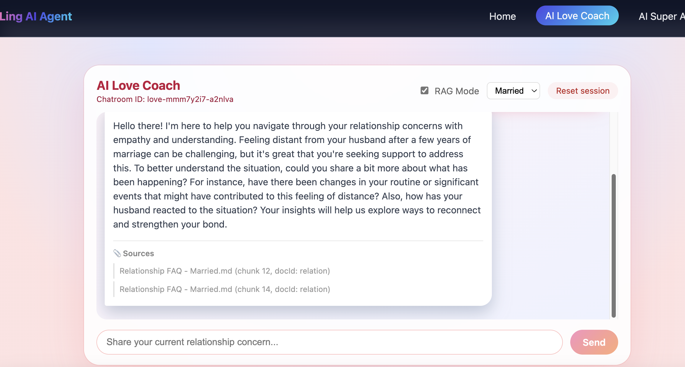

---

## ⚙ Tech Stack

**Backend**
- Java 21
- Spring Boot 3.4
- Spring AI 1.0.0

**AI & LLM**
- OpenAI API (GPT-4o) — primary
- Alibaba DashScope API (Qwen-Plus) — alternative
- Switchable via configuration

**RAG & Storage**
- PostgreSQL + PGVector (vector similarity search, HNSW indexing)
- Cross-encoder reranking via Python FastAPI (sentence-transformers)
- Document ETL pipeline with batch embedding and SHA-256 deduplication

**Observability**
- LangSmith (via OpenTelemetry OTLP export)
- Step-level tracing for RAG retrieval and agent reasoning

**Communication**
- REST API
- Server-Sent Events (SSE) for real-time streaming

**DevOps**
- Docker (containerized, cross-platform amd64 build via Docker Buildx)
- GitHub Actions CI/CD (automated build and push of Docker images)
- AWS EC2 (t3.micro, Ubuntu 24.04) — production deployment
- Apache JMeter (load testing)

**Testing**
- JUnit 5 (unit tests for core agent logic)
- Spring Boot Test (integration tests)

**API Documentation**
- Knife4j (Swagger UI)

---

## 🔑 Key Implementation Highlights

**1. Custom ReAct Agent Framework**
Designed a 4-layer agent architecture (`BaseAgent → ReActAgent → ToolCallAgent → LingManus`) 
implementing the ReAct pattern with autonomous tool selection, async execution, and 
stuck-loop detection. Complex tasks typically complete in 6-8 steps.

**2. RAG Pipeline with Custom Advisors**
Built `LoveAppRagCustomAdvisorFactory` and `QueryRewriter` from scratch instead of using 
Spring AI defaults, enabling query rewriting and search enhancement before vector similarity 
search for improved retrieval relevance. Optimized batch embedding ingestion from 30 API 
calls down to 2 per document.

**3. Cross-Encoder Reranking Pipeline**
Integrated a Python FastAPI microservice running `ms-marco-MiniLM-L-6-v2` cross-encoder 
to re-score top-6 vector search candidates and return top-3 most relevant chunks, improving 
retrieval precision over pure cosine similarity. Implemented graceful fallback to original 
ranking when reranking service is unavailable.

**4. LangSmith Observability Integration**
Integrated LangSmith tracing via OpenTelemetry OTLP export, enabling step-level visibility 
into RAG retrieval, agent reasoning, and LLM calls. Captures token usage, latency 
percentiles, and error rates per request in real time.

**5. Non-blocking SSE Streaming Architecture**
Built real-time streaming responses using `CompletableFuture.runAsync()` and `SseEmitter`, 
ensuring long-running agent tasks do not block web server threads. Maintained 0% error 
rate under concurrent load tests.

**6. MCP Protocol Integration**
Developed a standalone MCP Server supporting both Stdio (local) and SSE (remote) transport 
modes, enabling AI to dynamically call external services (Pexels image search) via 
standardized protocol.

**7. Agent Stability Engineering**
Implemented `isStuck()` loop-detection heuristics and recovery prompts in `BaseAgent` to 
prevent infinite reasoning cycles and uncontrolled token consumption.

**8. Prototype-scoped Agent Instances**
Applied `@Scope("prototype")` to LingManus so each conversation creates a fresh agent 
instance, preventing state pollution across concurrent users.

**9. Cloud-ready Container Deployment**
Containerized the system with Docker and deployed on AWS EC2, resolving ARM → amd64 
architecture mismatch using Docker Buildx for cross-platform compilation.

---

## 🧩 System Modules

### Agent Framework (4-layer architecture)
```
BaseAgent → ReActAgent → ToolCallAgent → LingManus
```
- `BaseAgent`: Agent loop, SSE streaming, stuck-loop detection
- `ReActAgent`: Splits execution into `think()` + `act()`
- `ToolCallAgent`: Tool selection and execution via Spring AI
- `LingManus`: Final agent with all 6 tools injected

### AI Services Layer
- Pre-Advisors: query rewriting, RAG retrieval, cross-encoder reranking
- ChatModel routing engine (multi-LLM support)
- Tool execution framework
- RAG knowledge pipeline with custom advisors

### Tools Implemented (6)
1. Web Search
2. Web Scraping
3. File Operations
4. Resource Download
5. PDF Generation
6. Terminal Operations

### MCP Server
- Standalone Spring Boot service on port 8127
- Pexels API image search tool
- Supports Stdio (local) and SSE (remote) transport modes

### Reranking Service
- Python FastAPI microservice on port 8000
- Cross-encoder model: `ms-marco-MiniLM-L-6-v2`
- Graceful fallback to original ranking on failure

---

## ☁️ Cloud Deployment

Backend containerized with Docker and deployed to AWS EC2 via a GitHub Actions CI/CD pipeline.

| Platform | Type | Details |
|----------|------|---------|
| AWS EC2 | Compute | t3.micro, Ubuntu 24.04, Docker runtime |
| Docker Hub | Registry | Public image hosting |

> Resolved ARM → amd64 cross-platform build issue using Docker Buildx
>  > Docker images are automatically built and pushed to Docker Hub via GitHub Actions CI/CD on every commit.

---

## 📦 Local Docker Deployment
```bash
# Build image (for amd64/EC2)
docker buildx build --platform linux/amd64 -t your-dockerhub/loveapp-backend:amd64 .

# Push to Docker Hub
docker push your-dockerhub/loveapp-backend:amd64

# Run container
docker run -d --name ling-ai-backend \
  -p 8123:8123 \
  -e SPRING_PROFILES_ACTIVE=prod \
  -e OPENAI_API_KEY=your_key \
  your-dockerhub/loveapp-backend:amd64
```

---

## 🚀 Quick Start

### Option 1: Docker Compose (One-click startup)
```bash
# 1. Copy environment file
cp .env.example .env
# Edit .env and fill in your API keys

# 2. Start all services (PostgreSQL + Backend)
docker-compose up -d

# 3. Check status
docker-compose ps
```

### Option 2: Local Development

**Prerequisites**
- Java 21, Maven 3.9+
- PostgreSQL with PGVector extension
- Node.js 18+
- Python 3.10+

**Backend**
```bash
git clone https://github.com/LING-6150/ling-ai-agent.git
cd ling-ai-agent
# Configure application-local.yml with your API keys
mvn spring-boot:run
```

**Reranking Service**
```bash
cd reranking-service
pip3 install fastapi uvicorn sentence-transformers
python3 rerank_service.py
# Runs on http://localhost:8000
```

**MCP Server (optional)**
```bash
cd ling-image-search-mcp-server
mvn spring-boot:run
```

**Frontend**
```bash
cd ling-ai-agent-frontend
npm install
npm run dev
```

---

## 🎯 Project Goals

This project demonstrates how to build a **production-style AI agent system**, integrating:
- ReAct agent architecture with 4-layer inheritance
- RAG pipeline with cross-encoder reranking for improved precision
- LangSmith observability for production monitoring
- Tool calling pipelines with 6 real-world tools
- Real-time streaming interaction via SSE
- MCP protocol for standardized tool integration
- Containerized deployment with Docker on AWS EC2

Designed as part of an advanced AI engineering portfolio.

---

## 📝 Resume Bullets
```
Architected a production-grade RAG pipeline combining PGVector (HNSW indexing) with hybrid retrieval (vector similarity + BM25 via RRF fusion), query rewriting, and cross-encoder reranking (ms-marco-MiniLM-L-6-v2) via a Python FastAPI microservice; reduced embedding API costs by 93% (30→2 calls/doc) via SHA-256 content-based deduplication and built a dynamic PDF ingestion pipeline with real-time chunking and AI keyword metadata enrichment
Engineered a ReAct-based hierarchical agent framework (BaseAgent → ReActAgent → ToolCallAgent → LingManus) with stuck-state detection, human-in-the-loop escalation, and self-termination; integrated LangSmith tracing via OpenTelemetry and delivered real-time SSE streaming with persistent multi-session memory and sliding window context management
Built tool orchestration layer with 6 MCP tools for web search, scraping, file operations, and PDF generation over Stdio/SSE transport; containerized with Docker and deployed on AWS EC2; implemented CI/CD with GitHub Actions to automatically build and push Docker images using Docker Buildx for ARM→amd64 cross-platform builds
Sustained 41 req/min throughput with P95 latency ~6.1s and 0% error under concurrent load (Apache JMeter); implemented persistent file-based sliding-window chat memory```

---

## 👩‍💻 Author

**Ling Duan**  
MS in Information Systems — Northeastern University  
AI Engineering & Intelligent Systems Focus  
[GitHub](https://github.com/LING-6150)

---

*Built with Spring AI 1.0.0 | March 2026*
